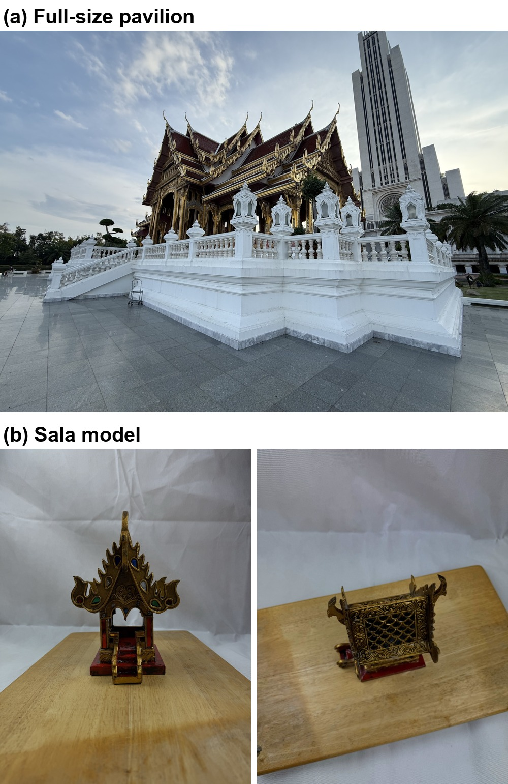
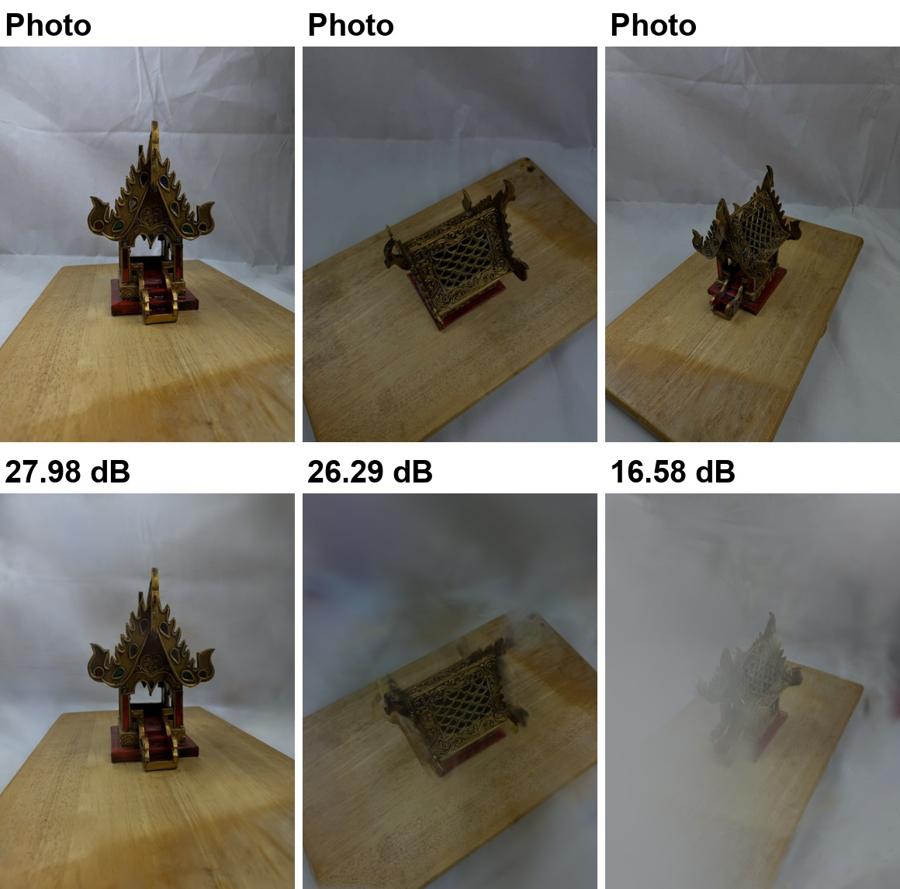
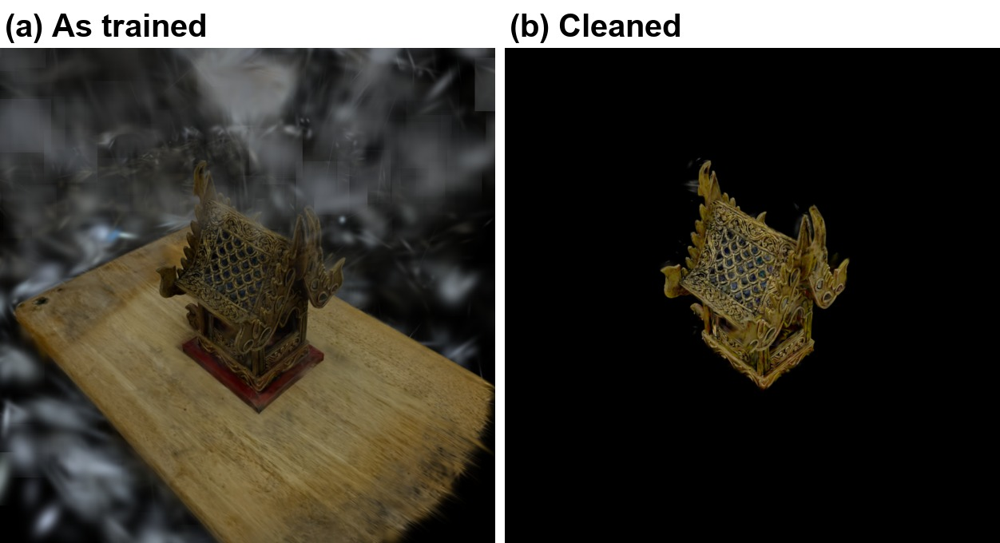
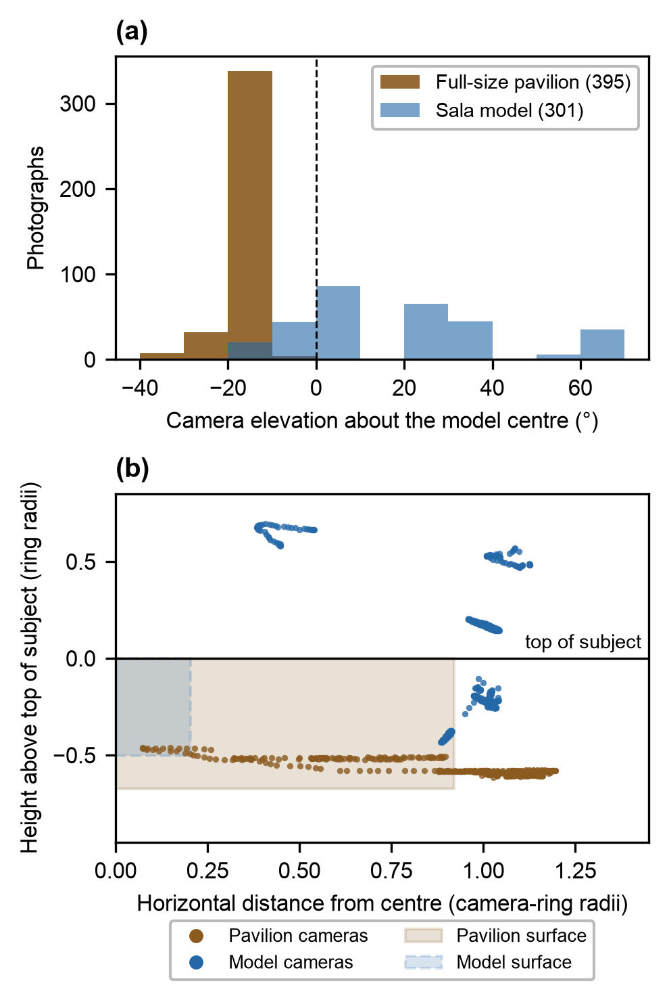
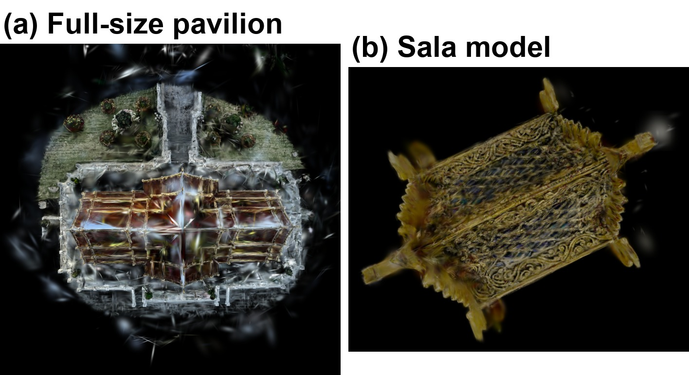
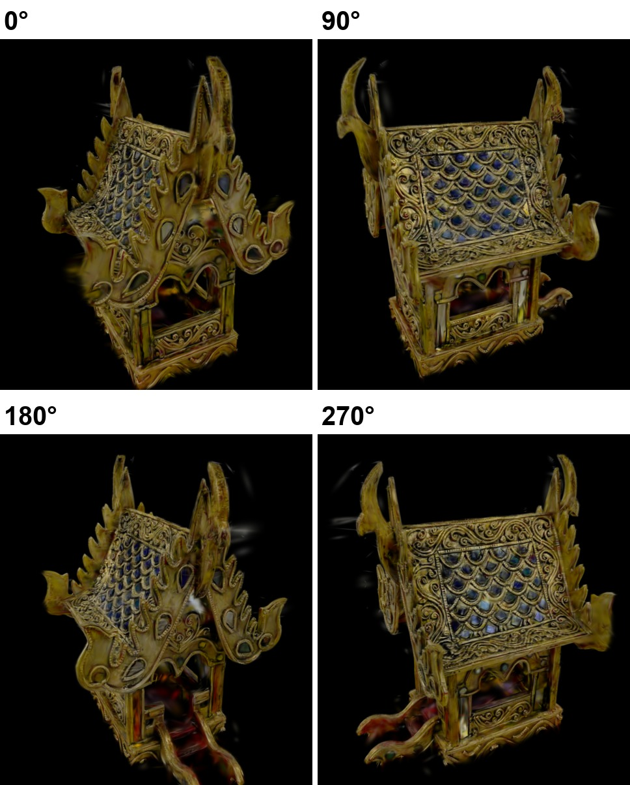

# Version 6 (final): two more pavilion runs, and a smaller sala we could photograph from above

**Results for Version 6 · Sala Chaturamuk Phaichit · CSX4213**
Compiled 15 September 2026. Covers the week since Version 5: the pavilion runs of 9 and 10 September,
the capture of the sala model on 12 September and its Kaggle run of 12–13 September.
This is the last version of the project. Companion to `CSX4213_Sala_Thai_Version6.docx`, which carries
the same material inside the full paper.

---

## 1. What happened this week

Version 5 left two things open on the pavilion: a sky mask that behaved differently from frame to
frame, and a roof that no photograph had ever looked down on. We ran the pavilion twice more to deal
with the first. The second could not be fixed with the full-size building: three captures had missed
the roof, and getting a camera above it was not possible with the access and equipment we had. So we
photographed a smaller model of the same sala indoors, where holding the phone above the roof is as
easy as holding it beside it, and ran it through the same pipeline.

| | Photographs | Registered | Whole-frame PSNR | SSIM | LPIPS |
|---|---|---|---|---|---|
| Pavilion, Version 5 (colour sky mask, 7 Sep) | 446 | 395 | 20.10 dB | 0.739 | 0.342 |
| Pavilion, sky trained (9 Sep) | 446 | 395 | 23.45 dB | 0.769 | 0.333 |
| Pavilion, sky masked (10 Sep) | 446 | 395 | 14.45 dB* | 0.683 | 0.403 |
| **Sala model (12 Sep)** | 301 | **301** | **25.08 dB** | **0.851** | 0.371 |

\*The sky-masked model renders no sky on purpose; on the pavilion pixels alone it scores 22.61 dB
against 22.34 dB for the sky-trained run.

The model scores highest, but it is a small object in even indoor light in front of a plain backdrop,
which is easier than a building outdoors, and its LPIPS is worse than the pavilion's. What the numbers
show is that the capture was good, not that the method got better.

---

## 2. The two pavilion runs

Both reused the Version 5 COLMAP result (395 registered, 50 held out) and trained 30,000 iterations,
so only the sky treatment differs.

- **Sky trained, 9 Sep.** No mask. Photographs used as taken, background removed afterwards by cropping
  about the true vertical and dropping oversized Gaussians, with a wider crop than Version 5 (which had
  cut into the terrace).
- **Sky masked, 10 Sep.** SegFormer-B2 trained on ADE20K labels the sky in every frame (long edge 1024,
  mask eroded 6 px). The mask goes to training as an alpha channel, the render is multiplied by it
  before the loss, so masked pixels give no gradient. Sparse points seen mostly as sky were dropped
  before training: 1,409 of 240,357.

| | Version 5 | Sky trained | Sky masked |
|---|---|---|---|
| Whole-frame PSNR | 20.10 dB | 23.45 dB | 14.45 dB |
| Pavilion-only PSNR | – | 22.34 dB | 22.61 dB |
| Worst view (whole frame) | 10.45 dB | 14.78 dB | 9.58 dB |
| Gaussians published | 291,764 | 593,708 | 597,067 |
| Gaussians in sky in ≥50% of views that see them | – | 632 | 34 |

Dropping the colour mask lifted the whole frame by 3.35 dB and the worst view by 4.33 dB. The learned
mask is better on the pavilion in 42 of 50 views (best +2.33 dB, worst −0.64 dB), a small gain; its
real effect is in the empty space, where almost no Gaussians are left in the sky. Held-out photographs
are 28.3% sky on average (1.2% to 43.5%), which is why its whole-frame score is not comparable.
Neither run adds the upper surface of the roof, because no photograph saw it.

Sources: `kaggle_out/v6/sala/`, `kaggle_out/v7/sala/`, `results/sala_skymask/`.

---

## 3. The sala model

Captured 12 September 2026, 08:14–08:42: one iPhone 17 Pro, 24 mm equivalent on all 301 frames, EXIF
kept, six rings of 41 to 65 frames at different heights. The object stayed still and the camera moved:
over the first twenty frames the background corners change by a mean of 13.88 grey levels between
consecutive photographs.

Three changes from the pavilion notebook:

1. **Exhaustive matching.** Measured on the prepared photographs before COLMAP: neighbours in a ring
   share 241 RANSAC inliers, ring seams 12–25, and the strongest cross-ring links (78–91) are about 60
   frames apart, out of reach of any sequential window. Views 90° apart share only 9, so the four-fold
   symmetry that forced sequential matching on the pavilion does not show up here. All 45,150 pairs
   were matched.
2. **No sky mask.** There is no sky indoors.
3. **Geometric cleaning of the published model** (`tools/clean_salamodel.py`), after training, because
   the notebook's floater threshold (0.147 units) was larger than 99.9% of this scene's Gaussians and
   removed only 3,557 of 225,756. Cuts: outside 0.90 of the model's vertical axis, below the board top
   or above the model top, largest axis over 0.05, opacity under 0.15; then a gamma of 1.9 on colour.
   77,626 of 222,199 Gaussians remain.

One preparation defect: the phone stored landscape pixels with an EXIF rotation flag, which COLMAP
ignores. The rotation was written into the pixels, giving 1200 × 1600 on all 301 frames.

**Result.** 301 of 301 registered into one model; 7 h 27 min on Kaggle. On 38 held-out views:
25.08 dB / 0.851 / 0.371, per view 16.58 to 30.58 dB, median 25.93.

The weak views are haze in front of the model, the same failure as sky outdoors with the cloth
standing in for it. From one fixed camera (the notebook's opening view, offline renderer),
93.1% of the frame is non-background for the trained model and 8.8% after cleaning
(`figs_v6/fig_v6_model_clean.json`). **The held-out scores were not recomputed after cleaning** and
belong to the trained model.

---

## 4. Full-size pavilion against the model

| | Full-size pavilion | Sala model |
|---|---|---|
| Setting | outdoors, by the lake | indoors, on a table |
| Photos / registered | 446 / 395 | 301 / 301 |
| Matching | sequential | exhaustive |
| Highest camera (elevation about model centre) | −9.7° | +67.7° |
| Cameras above horizontal | 0 | 237 |
| Cameras above the top of the subject | 0 | 151 |
| Highest camera vs. top of subject | −0.46 ring radii | +0.70 ring radii |
| Reconstructed surface radius / camera ring | 0.92 | 0.20 |
| 30° azimuth sectors covered | 12 of 12 | 12 of 12 |
| PSNR / SSIM | 23.45 / 0.769 (sky trained) | 25.08 / 0.851 |
| LPIPS | 0.333 | 0.371 |
| Gaussians in the viewer | 593,708 | 77,626 |

Why the model can be turned all the way round and seen from above, and the pavilion cannot:

- **Height.** Both captures went all the way round (at least 20 photographs in every 30° sector). But
  every pavilion camera looks *up* at the top of its roof, by at least 25.8°, while half of the model's
  cameras are above its top, looking down at up to 60.6°. A roof seen only from below is left to
  guesswork: from above the pavilion's roof keeps its outline but is streaked and tinted with sky
  colour, while the model shows both roof slopes, the ridge and its corner finials.
- **Distance.** The pavilion's reconstructed surface, building and terrace, reaches 0.92 of the camera
  ring: we were walking along its edge. The model reaches 0.20 of its ring, so each photograph held the
  whole object. (171 pavilion photographs from further away exist but were never trained.)
- **Background.** Behind the pavilion is sky, 28.3% of each held-out photograph, and scenery far enough
  away to give no parallax. Behind the model is a board and cloth close enough to change with every
  step, which is what broke the four-fold symmetry.

The model has no underside, since it stood on a board, and it is a smaller copy rather than the
pavilion itself. What it shows is that the gaps in the full-size reconstruction come from where the
camera could be placed, not from Gaussian splatting or the amount of training.

---

## 5. Where this leaves the project

This is the final version. If anyone picks the work up again, the useful next step is elevated
photographs of the real pavilion, cleaned the same way as the model, with a floater threshold set from
each scene. The image-based viewer remains the contribution of the project; the reconstructions are a
comparison beside it.

---

## 6. Reproducing the numbers

| Claim | Source |
|---|---|
| Pavilion run scores, per-view, Gaussian counts | `kaggle_out/{v6,v7}/sala/{results,per_view,frame}.json` |
| Pavilion-only PSNR, views improved, sky Gaussians | `results/sala_skymask/*.json` |
| SegFormer settings, sparse points dropped | `kaggle_out/v7/sala/sky_mask.json` |
| Model capture EXIF, ring sizes | `mdls` on the HEIC originals; `CV_Photos_prepared/salamodel_manifest.csv` |
| Matching inliers | OpenCV SIFT, ratio 0.75, RANSAC fundamental matrix at 3 px, prepared JPEGs |
| Model scores | `kaggle_out/salamodel/out_salamodel/{results,per_view}.json` |
| Cleaning | `tools/clean_salamodel.py` (reproduces the published viewer model exactly) |
| Elevation about model centre | median of the model's Gaussians, up from the cameras' own up axes (Version 5 method); pavilion from the 7 Sep `cameras.json` + `sala_cropped.splat` |
| Heights vs. subject top, surface radius | `tools/make_figs_v6.py`, `slice_top()` |
| Trained vs. cleaned pixel fractions | `tools/make_figs_v6.py`, written to `figs_v6/fig_v6_model_clean.json` |
| All figures | `tools/make_figs_v6.py`; paper built by `tools/build_docx_v6.py` |
